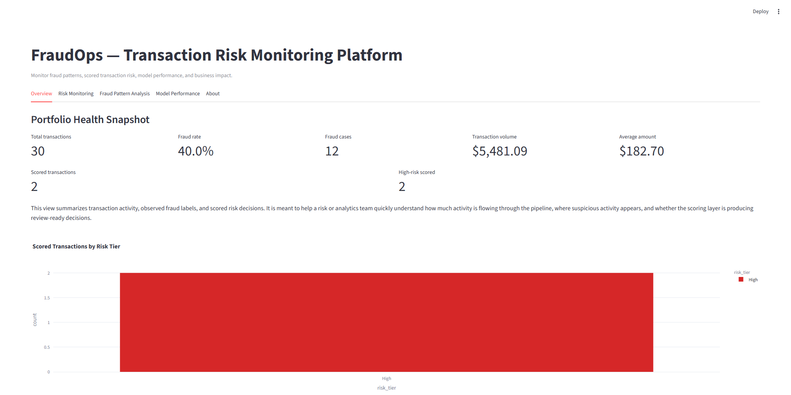
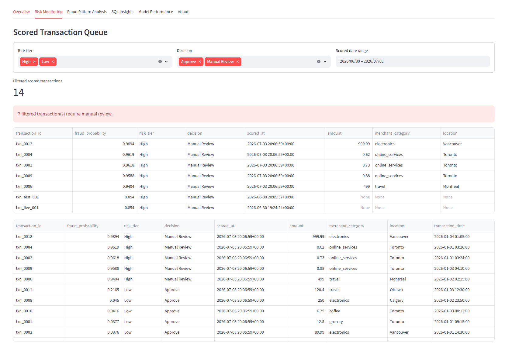
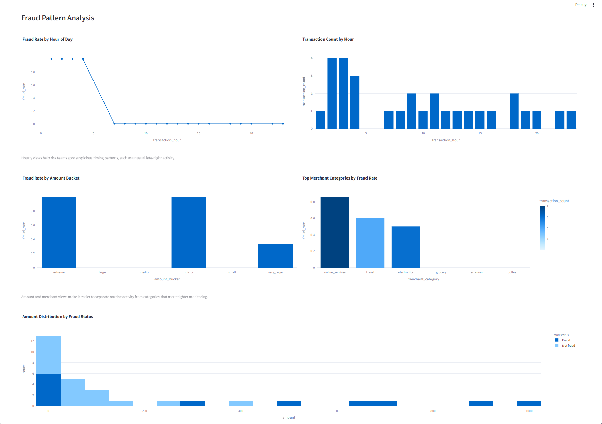
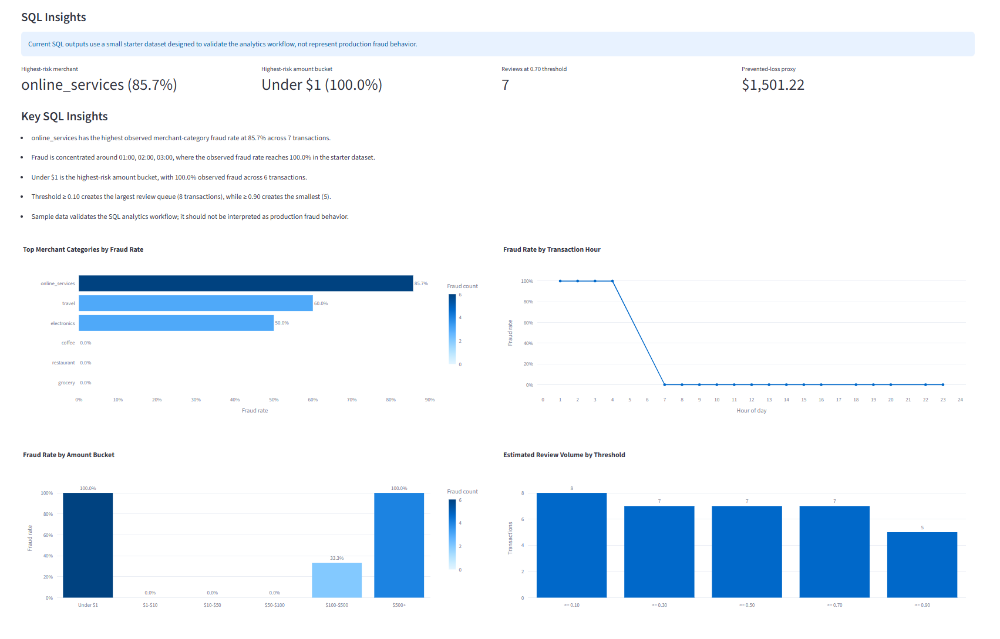
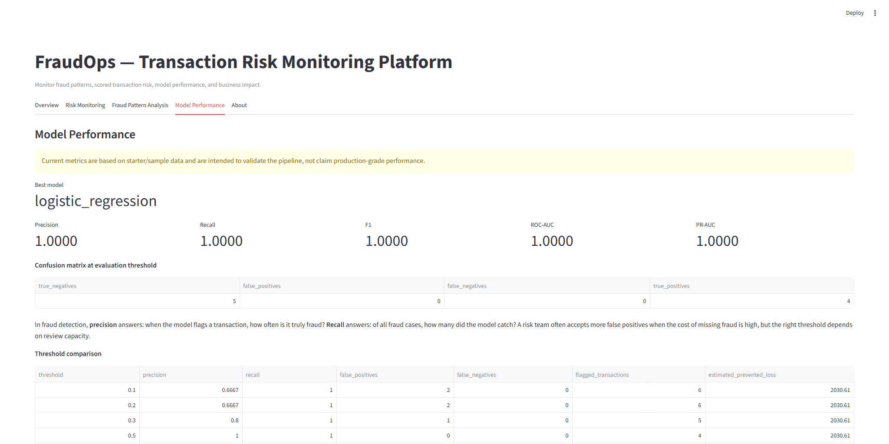
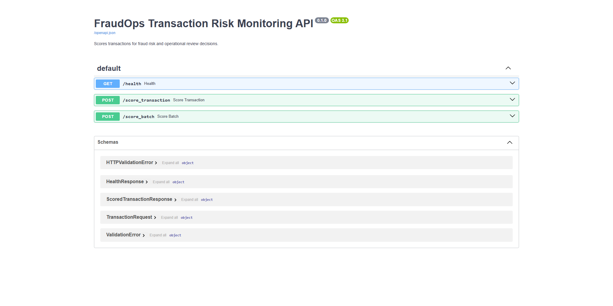
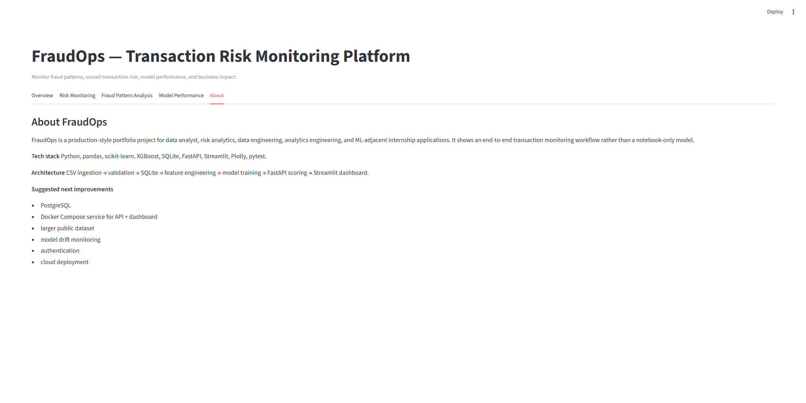

# FraudOps — Transaction Risk Monitoring Platform

An end-to-end fraud analytics platform that ingests transaction data, trains fraud detection models, exposes real-time scoring through FastAPI, and visualizes risk monitoring through Streamlit.

## Project Status

Portfolio-ready local build with ingestion, validation, SQLite storage, feature engineering, model training/evaluation, API scoring, dashboard monitoring, seed scoring, automated tests, CI, and container verification.

Current metrics are based on starter/sample data and are intended to validate the system pipeline, not claim production-grade fraud performance.

## Business Problem

Fraud detection is not just an accuracy problem. Real fraud datasets are usually imbalanced, meaning the model can look accurate while missing rare but costly fraud cases. Risk teams also care about false positives because every flagged transaction can create manual review burden, customer friction, and operational cost.

FraudOps frames model performance around precision, recall, threshold tradeoffs, review volume, false positives, false negatives, and estimated prevented loss. This makes the project closer to a real fraud operations workflow than a notebook-only classifier.

## Key Features

- CSV ingestion and schema validation
- SQLite data storage for clean and scored transactions
- SQL analytics layer for fraud KPIs, merchant risk, amount-bucket risk, review volume, and business-impact summaries
- Feature engineering for transaction time, amount, user behavior, merchant risk, and categorical signals
- Model training and evaluation for Logistic Regression, Random Forest, and optional XGBoost
- Threshold comparison with precision, recall, false positives, false negatives, review volume, and estimated prevented loss
- FastAPI scoring endpoints for single transactions and batches
- Streamlit dashboard for risk monitoring, fraud patterns, model performance, and project context
- Seed scoring script to populate dashboard demo rows
- Automated pytest suite
- Makefile workflow for common local commands

## Architecture

```mermaid
flowchart LR
    A[CSV Transactions] --> B[Validation & Cleaning]
    B --> C[SQLite Database]
    C --> D[Feature Engineering]
    D --> E[Model Training & Evaluation]
    E --> F[Model Artifacts]
    F --> G[FastAPI Scoring API]
    G --> H[Scored Transactions Table]
    H --> I[Streamlit Dashboard]
```



Flow:

```text
CSV data → validation → SQLite → feature engineering → model training → saved artifacts → FastAPI scoring → scored transaction database → Streamlit dashboard
```

See [assets/architecture.md](assets/architecture.md) for a standalone copy of the Mermaid diagram.

## Tech Stack

- Python
- pandas
- NumPy
- scikit-learn
- XGBoost
- SQLite
- FastAPI
- Streamlit
- pytest
- Plotly
- joblib

## SQL Analytics Layer

FraudOps includes a dedicated SQL analytics layer for fraud KPI monitoring,
hourly fraud patterns, amount-bucket risk, merchant risk, threshold review
volume, scored-transaction monitoring, and business-impact summaries.

```text
sql/
|-- 00_schema_overview.sql
|-- 01_fraud_kpis.sql
|-- 02_hourly_fraud_patterns.sql
|-- 03_amount_bucket_analysis.sql
|-- 04_merchant_risk_analysis.sql
|-- 05_threshold_review_volume.sql
|-- 06_scored_transaction_monitoring.sql
|-- 07_business_impact_summary.sql
`-- README.md
```

Example workflow:

```powershell
python -m src.ingestion
python -m src.train_model
python -m src.seed_scores
python -m src.sql_runner --all
```

Direct SQL runner commands:

```powershell
python -m src.sql_runner --list
python -m src.sql_runner --file sql/01_fraud_kpis.sql
python -m src.sql_runner --all
```

These SQL analyses convert transaction and model-scoring data into operational
fraud metrics such as fraud rate, review volume, high-risk merchant categories,
amount-bucket risk, and estimated prevented-loss proxies.

The sample dataset is intentionally small for local testing, so SQL outputs
validate the analytics workflow rather than represent production fraud behavior.

## Folder Structure

```text
fraudops-risk-monitoring/
├── api/
│   └── main.py                 # FastAPI scoring service
├── assets/
│   ├── architecture.md         # Mermaid architecture diagram
│   └── screenshots/README.md   # Screenshot capture checklist
├── dashboard/
│   └── app.py                  # Streamlit dashboard
├── data/
│   ├── raw/                    # Optional user-provided raw data
│   ├── processed/              # Generated clean CSV output
│   └── sample/                 # Starter sample transactions
├── models/
│   ├── feature_columns.json    # Saved model feature order
│   └── model_metrics.json      # Saved evaluation metrics
├── src/
│   ├── business_metrics.py     # Fraud operations metrics
│   ├── config.py               # Shared paths and constants
│   ├── database.py             # SQLite read/write helpers
│   ├── evaluate_model.py       # Saved-model evaluation script
│   ├── features.py             # Feature engineering
│   ├── ingestion.py            # CSV ingestion pipeline
│   ├── score.py                # Model scoring utilities
│   ├── seed_scores.py          # Demo scored-row seeding
│   ├── train_model.py          # Model training pipeline
│   └── validation.py           # Data validation and cleaning
├── tests/                      # pytest coverage
├── Makefile                    # Optional command shortcuts
├── requirements.txt
└── README.md
```

## Quickstart

### Windows PowerShell

```powershell
python -m venv .venv
.venv\Scripts\activate
pip install -r requirements.txt

python -m src.ingestion
python -m src.train_model
python -m src.evaluate_model
python -m src.seed_scores
python -m src.sql_runner --all
pytest
```

Start the API:

```powershell
uvicorn api.main:app --reload
```

API docs:

```text
http://127.0.0.1:8000/docs
```

Start the dashboard:

```powershell
streamlit run dashboard/app.py
```

Dashboard:

```text
http://127.0.0.1:8501
```

### Optional Makefile Commands

If `make` is available:

```bash
make install
make ingest
make train
make evaluate
make seed-scores
make sql-list
make sql-kpis
make sql-all
make test
make api
make dashboard
```

## API Usage

### `GET /health`

Returns service health.

```json
{
  "status": "ok",
  "service": "fraudops-risk-monitoring"
}
```

### `POST /score_transaction`

Scores one transaction.

Example request:

```json
{
  "transaction_id": "txn_001",
  "user_id": "user_123",
  "amount": 0.75,
  "merchant_category": "online_services",
  "transaction_time": "2026-01-15T03:24:00",
  "location": "Toronto"
}
```

Example response:

```json
{
  "transaction_id": "txn_001",
  "fraud_probability": 0.87,
  "risk_tier": "High",
  "decision": "Manual Review"
}
```

### `POST /score_batch`

Scores a list of transactions and returns a list of scored results. Scored results are also written to the `scored_transactions` SQLite table when available.

## Dashboard

The Streamlit dashboard includes six tabs:

- **Overview**: transaction volume, fraud rate, fraud cases, transaction value, scored transaction count, and high-risk scored count.
- **Risk Monitoring**: scored transaction queue with filters for risk tier, decision, and scored date.
- **Fraud Pattern Analysis**: fraud rate by hour, transaction count by hour, fraud rate by amount bucket, merchant-category fraud rates, and amount distribution by fraud status.
- **SQL Insights**: fraud KPI summary, top merchant risk categories, hourly fraud rates, and scored risk-tier distribution.
- **Model Performance**: best model, precision, recall, F1, ROC-AUC, PR-AUC, confusion matrix, threshold comparison, and a plain-English precision/recall explanation.
- **About**: project purpose, tech stack, architecture, and future improvements.

## Screenshots

### Streamlit Overview



### Risk Monitoring Queue



### Fraud Pattern Analysis



### SQL Insights



### Model Performance



### FastAPI Swagger Docs



### About



Screenshot file details and refresh notes are in [assets/screenshots/README.md](assets/screenshots/README.md).

## Testing

Run:

```powershell
pytest
```

The current test result is produced by GitHub Actions on each push and pull request.
Run `pytest -q` locally for the exact result on your checkout.

Coverage includes validation, ingestion, feature engineering, database setup, scored transaction storage/fetching, model training artifacts, scoring alignment, realistic scoring, API endpoints, dashboard data loaders, business metrics, seed scoring, SQL file inventory, SQL runner execution, and missing-database handling.

## Model Performance Note

Current metrics are based on starter/sample data and are intended to validate the system pipeline, not claim production-grade fraud performance. A real fraud model would need a larger representative dataset, temporal validation, threshold calibration, monitoring, and review-cost analysis.

## Future Improvements

- PostgreSQL
- Larger public fraud dataset
- Model drift monitoring
- Authentication and role-based access
- Cloud deployment
- Architecture image export for GitHub polish

See [MODEL_CARD.md](MODEL_CARD.md) for intended use and limitations, and
[SECURITY.md](SECURITY.md) before using any non-synthetic data.
