# FraudOps Architecture

```mermaid
flowchart LR
    A[CSV Transactions] --> B[Validation & Cleaning]
    B --> C[SQLite Database]
    C --> D[Feature Engineering]
    D --> E[Model Training & Evaluation]
    E --> F[Model Artifacts]
    F --> G[FastAPI Scoring API]
    G --> H[Scored Transactions Table]
    H --> I[Streamlit Dashboard]
```



Pipeline flow:

```text
CSV Transactions → Validation & Cleaning → SQLite Database → Feature Engineering → Model Training/Evaluation → Model Artifacts → FastAPI Scoring API → Scored Transactions Table → Streamlit Dashboard
```
